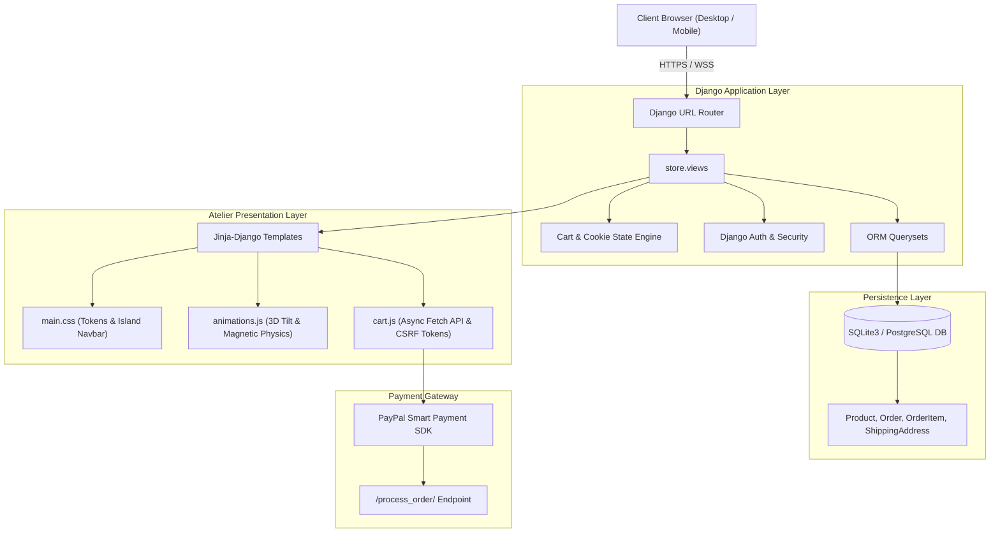

<div align="center">

# 🏛️ F U R N I T U R E L A N D
### *L'Atelier Nordique &mdash; Modern Architectural Living*

<p align="center">
  <b>A luxury Scandinavian e-commerce atelier engineered with Django, kinetic micro-physics, and tactile materials.</b>
</p>

[](https://www.djangoproject.com/)
[](https://www.python.org/)
[](https://github.com/Deveshgupta034/Furniture-Land)
[](https://github.com/Deveshgupta034/Furniture-Land)
[](https://developer.paypal.com/)
[](LICENSE)

<br/>

```
      .-----------------------------------------------------------.
     /   _   _   _   _   _   _   _   _   _   _   _   _   _   _   /|
    /   / \ / \ / \ / \ / \ / \ / \ / \ / \ / \ / \ / \ / \ / \ / |
   /   ( F | u | r | n | i | t | u | r | e | l | a | n | d ) /  |
  /     \_/ \_/ \_/ \_/ \_/ \_/ \_/ \_/ \_/ \_/ \_/ \_/ \_/ /   /
 /=========================================================/   /
|   "Form follows feeling. Materials endure generations."   |  /
 \=========================================================\/
```

<br/>

[Explore Collection](http://127.0.0.1:8000/) &bull; [Key Innovations](#-key-innovations) &bull; [Kinetic Physics](#-kinetic-physics-engine) &bull; [Quickstart](#-quickstart-guide) &bull; [Architecture](#-system-architecture)

</div>

---

## 📖 The Atelier Manifesto

**Furnitureland** reimagines digital furniture commerce as an architectural gallery walk. Moving away from sterile, boxy corporate storefronts, Furnitureland is grounded in **Scandinavian Quietude, Natural Hardwood Joinery, and Tactile Bouclé Textiles**.

Every card, swatch, transition, and button was crafted to emulate the physical weight and elegance of handcrafted European timber.

---

## ✨ Key Innovations

### 1. 🪑 Dynamic Universal Swatch & Fabric Switcher
- Real-time client-side texture switching across custom finishes:
  - **Natural Sand Bouclé** (`#D9D0C1`)
  - **Nordic Oat Weave** (`#C8B9A6`)
  - **Espresso Dark Timber** (`#3B2F2F`)
  - **Forest Moss Velvet** (`#4A5340`)
- Instant photo morphing with custom specular glare calculation.
- Dynamic pricing, stock badges, and material specifications update without page reloads.

### 2. 🪄 60fps Kinetic Physics Suite (`animations.js`)
- **3D Specular Tilt:** Product cards tilt in 3D perspective (`rotateX` / `rotateY`) following cursor physics, with an interactive radial light reflection.
- **Magnetic Buttons:** Primary CTA buttons magnetically attract toward the cursor with cubic-bezier spring tension.
- **Parabolic Particle Flow:** Adding any item to the bag launches a glowing gem particle through an arc directly into the floating navbar bag badge with a tactile cart bounce.
- **Fluid Floating Island Navbar:** Glassmorphic floating pill navigation bar (`backdrop-filter: blur(20px)`) that compacts smoothly on scroll.
- **Micro-Cursor Follower:** Hardware-accelerated smooth trailing cursor with automatic hover expansion (disabled automatically on touch devices).

### 3. 🛡️ Glassmorphic Authentication & Atelier Member Portal
- Redesigned **Sign In** and **Sign Up** interfaces with frosted crystal cards, contextual micro-hints, and CSRF protection.
- Django authentication with session-backed cart synchronization for both guest collectors and registered members.

### 4. 💳 Multi-Channel Checkout & PayPal Smart SDK
- Seamless transitions from bag inspection to delivery dispatch.
- Integrated **PayPal Smart Buttons** supporting global currencies, guest cards, and instantaneous order tokenization.
- White-glove delivery calculations and automated shipping dispatch notifications.

---

## 🎨 Design Tokens & Material System

| Token | Value | Swatch | Application |
| :--- | :--- | :---: | :--- |
| `--bg-root` | `#F7F5F0` |  | Nordic warm gallery parchment |
| `--card-bg` | `#FAF8F5` |  | Architectural pedestal white |
| `--accent-primary`| `#8C6D53` |  | Artisan chestnut & warm terracotta |
| `--accent-hover`  | `#70533C` |  | Deep aged cognac oak |
| `--text-primary`  | `#1F1E1D` |  | Deep volcanic graphite |
| `--text-secondary`| `#6B665F` |  | Muted linen shadow |
| `--border-subtle` | `rgba(45,39,34,0.08)` | &mdash; | Precision hairline separator |

### Typography Hierarchy
- **Editorial Headings:** `Cormorant Garamond`, `Playfair Display`, serif *(Graceful, timeless, editorial)*
- **Body & Controls:** `Plus Jakarta Sans`, `-apple-system`, sans-serif *(Clean, ultra-readable, tactile)*

---

## 🏗️ System Architecture



---

## ⚡ Quickstart Guide

### Prerequisites
- Python `3.10+` (tested on Python `3.12`)
- Git

### 1. Clone the Repository
```bash
git clone https://github.com/Deveshgupta034/Furniture-Land.git
cd Furniture-Land
```

### 2. Set Up Virtual Environment (Recommended)
```bash
# Windows
python -m venv env
.\env\Scripts\activate

# macOS / Linux
python3 -m venv env
source env/bin/activate
```

### 3. Install Dependencies
```bash
pip install django pillow
```

### 4. Apply Database Migrations
```bash
python manage.py makemigrations
python manage.py migrate
```

### 5. Launch the Atelier
```bash
python manage.py runserver 0.0.0.0:8000
```
Open **[http://127.0.0.1:8000/](http://127.0.0.1:8000/)** in your browser.

---

## 🌐 Instant Sharing with Friends

Want to show your local store to friends without deploying to cloud servers?

### Option A: Friends on the Same Wi-Fi (No tools required)
Your server binds to all interfaces (`0.0.0.0:8000`). Friends on your Wi-Fi can open your local IP directly:
```text
http://<YOUR-LOCAL-IP>:8000/
# Example: http://192.168.1.71:8000/
```

### Option B: Instant Public HTTPS Link via Pinggy
```bash
ssh -R 80:localhost:8000 a.pinggy.io
```

### Option C: Instant Public Link via Localtunnel
```bash
npx.cmd localtunnel --port 8000
```

---

## 📁 Repository Structure

```text
Furniture-Land/
├── ecommerce/                # Project Configuration
│   ├── settings.py           # Core Django settings & ALLOWED_HOSTS
│   ├── urls.py               # Root URL configuration
│   └── wsgi.py               # WSGI server gateway
├── store/                    # Core Storefront Application
│   ├── models.py             # Product, Order, Customer data models
│   ├── views.py              # Storefront, Cart, Checkout, Auth views
│   ├── urls.py               # App-specific endpoints
│   ├── templates/store/      # Atelier Design System Templates
│   │   ├── main.html         # Base layout with Island Navbar & Footer
│   │   ├── store.html        # Hero showcase & curated grid
│   │   ├── product_view.html # 3D Swatch configurator
│   │   ├── login.html        # Member authentication
│   │   ├── signup.html       # Atelier registration
│   │   ├── cart.html         # Curated bag summary
│   │   ├── checkout.html     # White-glove delivery & PayPal
│   │   ├── sofa.html         # Seating collection
│   │   ├── dining_table.html # Architectural tables
│   │   ├── decor.html        # Sculptural objects
│   │   ├── kids.html         # Junior living
│   │   └── aboutus.html      # Brand philosophy & craft manifesto
├── static/                   # Static Assets
│   ├── css/main.css          # Design tokens, typography & components
│   ├── js/animations.js      # 3D tilt, magnetic buttons, cart particles
│   ├── js/cart.js            # Asynchronous cart API dispatcher
│   └── images/               # High-res photography & swatches
├── .gitignore                # Clean Python, Django & IDE exclusions
├── manage.py                 # Django CLI management utility
└── README.md                 # Atelier Documentation & Manifesto
```

---

## 🧪 Testing Suite

Run the full automated test suite covering views, models, authentication, and cart logic:

```bash
python manage.py test store
```

---

## 🤝 Contributing

1. Fork the Project
2. Create your Feature Branch (`git checkout -b feature/scandinavian-enhancement`)
3. Commit your Changes (`git commit -m 'feat: add tactile linen zoom interaction'`)
4. Push to the Branch (`git push origin feature/scandinavian-enhancement`)
5. Open a Pull Request

---

## 📄 License

Distributed under the MIT License. See `LICENSE` for more information.

<div align="center">
  <sub>Crafted with passion, oak, and bouclé by <a href="https://github.com/Deveshgupta034">Devesh Gupta</a>.</sub>
</div>
